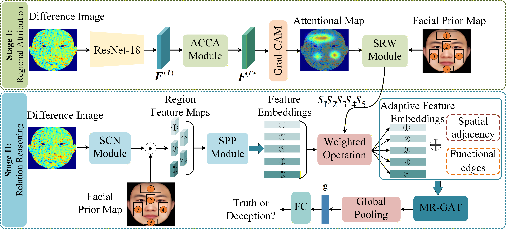

# The Face of Deception: StO2 Dataset, Pattern Analysis, and Detection Model

This project provides the full implementation of PhyRIG-Net, a physiology-guided region–relation graph framework for deception detection using facial tissue oxygen saturation (StO2) imaging.
It includes dataset visualization tools, model architecture, training/testing scripts, and all components needed to reproduce the experimental results.

### 🚀 Getting Started:
  - 
    **1. Clone this repository**
    ```bash
    git clone https://github.com/Swu-wanghp/DeepStO2.git
    cd OxyRIG-Net
    ```

    **2. Prepare environment**
    ```bash
    conda create -n env_name python=3.8
    conda activate env_name
    pip install -r requirements.txt
    ```

    **3. Upload StO2 data**
    The StO₂-Deception-Detection dataset is publicly available for academic research.
    Researchers can obtain access by contacting the corresponding author via email
    (ctong@swu.edu.cn; chentong@psych.ac.cn) and signing a License Agreement.

    **4. Download pretrained features**
    ```bash
    tar -xf features.tar.gz -C dir_to_save_feature
    ```

    **5. Training**
    ```bash
    python train.py \
      --root_path /root/data/hd5_for_train \
      --adj_path /root/DeepStO2/model/adj.npy \
      --weightFilePath /root/DeepStO2/region_results.json \
      --output /root/DeepStO2/tools/results \
      --train_epoch 200 \
      --lr 0.001 \
      --train_batchsize 32 \
      --test_batchsize 1
    ```

    **6. Inference**
    ```bash
    python test.py \
      --root_path /root/data/hd5_for_train \
      --adj_path /root/DeepStO2/model/adj.npy \
      --weightFilePath /root/DeepStO2/region_results.json \
      --output /root/DeepStO2/tools/results \
      --sub_num 48 \
      --test_batchsize 1

    ```
    We also provide ckpts, logs, etc. to reproduce the results in the paper.
    Please download `ckpt.tar.gz`.

### 📊 Dataset Overview:
  - |
    The Deception-Detection-StO₂ dataset includes three experimental paradigms with increasing stress intensity:
    1. Personal Information Description — low stress  
    2. Factual Statement — moderate stress  
    3. Mock Crime — high stress  

    

    **Figure 1.** StO2 patterns for six subjects across experimental conditions. The pseudo-color mappings illustrate relative oxygenation. Warm tones indicate high
    blood oxygen levels, whereas cool tones indicate the opposite.

### 🧠 Model Overview:
  - |
    The overall framework of PhyRIG-Net.
    

    **Figure 1.** Overall framework of PhyRIG-Net. Stage I performs physiology-guided regional attribution using an ACCA-enhanced ResNet-18 with Grad-CAM,
    constrained by a predefined facial prior of five ROIs (1–5: forehead, nose, left cheek, right cheek, and chin). Stage II conducts multi-relation reasoning based
    on spatial adjacency and functional co-activation, generating the final deception prediction through permutation-invariant graph pooling.

### 📬 Contact:
  - |
    If you have any questions or encounter any issues,
    please feel free to open an issue or contact:
    - Tong Chen — ctong@swu.edu.cn / chentong@psych.ac.cn  

### 🙏 Acknowledgement:
  - |
    This research was supported by the Key Laboratory of Cognitive Neuroscience,
    Southwest University, and the Institute of Psychology, Chinese Academy of Sciences.
